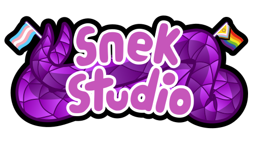
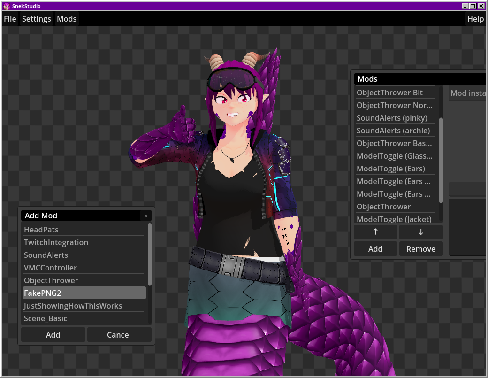

# SnekStudio Super ~~Secret~~ Public Alpha Edition



Hello! Welcome to the alpha version of SnekStudio. This is the software I've
been using in production for streams since around 2022. It's "organically
grown", so-to-speak. The code's a bit of a mess, but I've finally decided to
make it open-source and available to everyone.

Anyway, this is just my way of saying the code will do psychic damage to you if
you look too closely into my code crimes.

<3

## Getting started (Linux + Windows)

Builds are coming very soon, but for now here are the steps to get it running
using a copy of the Godot editor.

1. Clone the repo.

   ```
   git clone --recursive https://github.com/ExpiredPopsicle/SnekStudio.git
   ```
   If you didn't do the `--recursive` parameter, then you'll have to do
   `git submodule init` and `git submodule update` inside the repo.

2. Open the project up in Godot 4.3.

3. Download the latest Python Standalone Build.

	1. Click on the "Python Builds" tab in the bottom of the Godot editor. Note
	   that you will only see this tab if the KiriPythonRPCWrapper addon is
	   enabled, which it should be.

	2. Click the "Download" button next to the platform(s) you want to build
	   for.

	3. Click the other "Download" button in the column for the dependencies.
	   Wait a bit because it'll look like it's frozen, but it's just downloading
	   files.

4. Run it from the editor.

   First-time startup will take a long time and appear to freeze at first! This
   is because it's downloading Python modules it needs. (Visual feedback for
   this will be added later.)

5. Load up a model.

   Note: Only VRM 0.0 models are currently supported. VRM 1.x will have serious issues.

   File -> Open VRM...

6. Configure the MediaPipe Tracker.

   Mods -> Mod List...

   Select MediaPipeController.

7. Select a video device from the Video Device list.

   Sometimes there will be duplicate devices. If the one you want doesn't
   work, try the duplicate.

8. Select blend shapes mode.

   If your VRM supports the 50-something extra blend shapes (the
   "Perfect Sync" blend shapes, ARKit blend shapes, MediaPipe blend
   shapes, etc), then make sure "Use MediaPipe Shapes" is checked and
   "Use basic VRM shapes" is un-checked.

   If your VRM does NOT support those, then make sure "Use MediaPipe
   Shapes" is un-checked and "Use basic VRM shapes" is checked.

9. Set arm rest angle.

   After this, you can close the Mods settings.

10. Set the window to transparent, if desired.

	Settings -> Window... -> Transparent background

	Should work with OBS Xcomposite capture.

11. (Optional) Set up colliders and then thrown object redeems.

	Note: Thrown objects will not work without colliders.

## Project Goals

1. Make a solution for 3D VTuber face/model tracking.

2. Make it free for everyone to use.

3. Make a fully open-source.

4. Make it as cross-platform.
  - Supporting x86, AMD64, ARM, and other architectures.
  - Supporting Linux and Windows, with possible Mac and limited web (HTML5)
	support down the road.

5. Make it compatible with existing standards.
  - Support VRM.
  - Support VMC.

6. Make it as accessible to everyone as possible.
  - Minimal system hardware requirements.

7. Make it last as long as possible.
  - Do not tie ourselves to technologies at risk of becoming unsupported.
  - Make the code clean, modular, and easily maintainable.
  - Do not rely on native code with complex build environment requirements (eg
	other languages).

## Known Issues

So many. Please please please use the bug reporting tools on Github.
